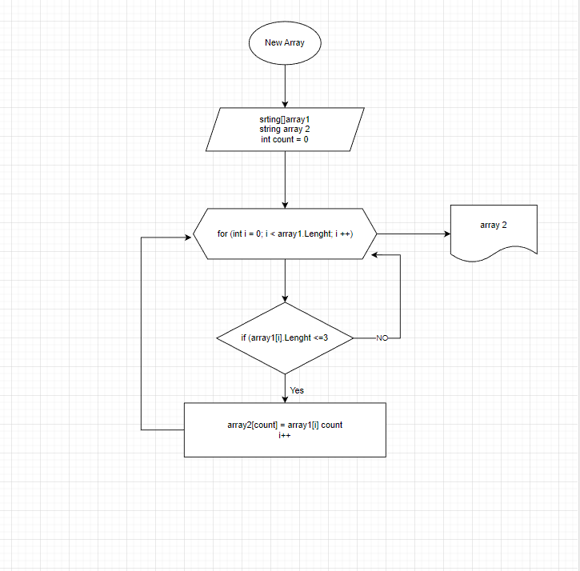

# Задача: 

Написать программу, которая из имеющегося массива строк формирует новый массив из строк, длина которых меньше, либо равна 3 символам. Первоначальный массив можно ввести с клавиатуры, либо задать на старте выполнения алгоритма. При решении не рекомендуется пользоваться коллекциями, лучше обойтись исключительно массивами.

*Примеры:*

[“Hello”, “2”, “world”, “:-)”] → [“2”, “:-)”]

[“1234”, “1567”, “-2”, “computer science”] → [“-2”]

[“Russia”, “Denmark”, “Kazan”] → []

# **Описание способа решения задачи:**

* Задаем наш изначальный алгоритм на страрте, согладно допустимому условию поставленной задачи. Объявляем этот массив определенной длинны и задаем второй массив, который нам необходимо получить в решении задачи той же длинны.

* Создаем метод (функцию) внутри которой в цикле соразмерному длинны массива, проверяется условие, при котором каждый элемент массива,а точнее его длинна менее или равна 3.

* При выполнении этого условия - срабатывает счетчик (count) соответствия условию и он автоматически является счетчиком нового массива и соответственно заполняет его элемент из первоначально массива и исходный. Так же эта переменная поочередно переводит элементы массива для итогового отсутствия пробелов. После каждого шага проверки счетчик увеличиваем на 1 до размера самого массива и возвращаем к циклу for в котором i увеличивается на 1. 

# Графическое изображение блок-схемы решения задачи представлено в файле **diagrams.net.png**.
()

# Алгоритм решения представлен в папке *Tesk* >>> путь в файл Program.cs

